<p align="center">
  
</p>

<p align="center">
  
</p>

<p align="center">
  <a href="https://superrrkyy.github.io/web-memperingati-maulid-nabi/">
    
  </a>
</p>

<p align="center">
  
  
  
  
  
</p>

---

> Website peringatan **Maulid Nabi Muhammad SAW** yang berisi sejarah, makna, dalil Al-Qur'an & Hadits, tradisi perayaan di Indonesia, serta hikmah memperingati kelahiran Rasulullah ﷺ.

### 📸 Tampilan

<p align="center">
  <a href="https://superrrkyy.github.io/web-memperingati-maulid-nabi/">
    
  </a>
  <br>
  <sub><i>Halaman utama. Ketuk gambar untuk membuka website.</i></sub>
</p>

---

### ✨ Fitur

- 🎨 **Desain Islami** bernuansa hijau & emas yang elegan
- 🖋️ **Kaligrafi Arab** dengan font Amiri
- 📱 **Responsif** di HP, tablet, dan desktop
- 💫 **Animasi halus** saat scroll
- 🧭 **Navigasi sticky** + menu mobile
- ⚡ **Ringan**: cukup satu file HTML, tanpa instalasi

---

### 📖 Isi Website

| | Bagian | Keterangan |
|:-:|:--|:--|
| 🏠 | **Beranda** | Hero dengan kaligrafi Arab |
| 📘 | **Tentang** | Pengertian Maulid Nabi & info kelahiran |
| 📜 | **Sejarah** | Timeline peringatan Maulid dari masa ke masa |
| 💡 | **Makna** | 6 makna & tujuan memperingati Maulid |
| 📖 | **Dalil** | Ayat Al-Qur'an & Hadits terkait |
| 🇮🇩 | **Tradisi** | Grebeg Maulud, Baayun Mulud, Kuah Beulangong, dll. |
| 🌟 | **Hikmah** | 5 hikmah memperingati Maulid |

---

### 🚀 Cara Menjalankan

**Online:** langsung buka 👉 **[superrrkyy.github.io/web-memperingati-maulid-nabi](https://superrrkyy.github.io/web-memperingati-maulid-nabi/)**

**Offline:**

```bash
git clone https://github.com/superrrkyy/web-memperingati-maulid-nabi.git
cd web-memperingati-maulid-nabi
```

Lalu buka `index.html` di browser. Tidak perlu menginstal apa pun.

<details>
<summary><b>📂 Struktur file</b></summary>
<br>

```
web-memperingati-maulid-nabi/
├── index.html   # Seluruh konten + CSS + JavaScript
├── assets/      # Banner & screenshot README
└── README.md
```

</details>

---

### 🛠️ Teknologi

- **HTML5**: struktur halaman semantik
- **CSS3**: Custom Properties, Flexbox, Grid, Animations
- **JavaScript (Vanilla)**: menu mobile & animasi scroll
- **Google Fonts**: [Poppins](https://fonts.google.com/specimen/Poppins) & [Amiri](https://fonts.google.com/specimen/Amiri)

---

### 📝 Catatan

> [!NOTE]
> Website ini dibuat untuk tujuan **edukasi** dan menyebarkan kecintaan kepada Rasulullah Muhammad SAW. Bebas digunakan untuk keperluan personal maupun edukasi. Silakan fork, modifikasi, dan sebarkan kebaikan. 🤍

---

<p align="center">
  <b>اَللّٰهُمَّ صَلِّ عَلٰى مُحَمَّدٍ وَّعَلٰى اٰلِ مُحَمَّدٍ</b>
  <br>
  <i>Ya Allah, limpahkanlah shalawat dan salam kepada Nabi Muhammad dan keluarga beliau.</i>
  <br><br>
  Dibuat dengan 💚 oleh <a href="https://github.com/superrrkyy"><b>AXRYZURE</b></a>
</p>
